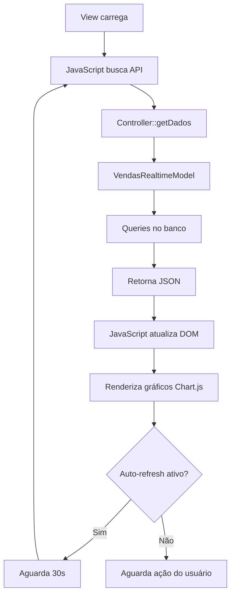

# 📊 Dashboard de Vendas em Tempo Real

## 🎯 Visão Geral

Dashboard inspirado no **Google Analytics** para acompanhamento de vendas em tempo real, com métricas, gráficos interativos e auto-atualização.

---

## ✨ Características

### **Visual**
- ✅ Design inspirado no Google Analytics
- ✅ Layout clean e moderno
- ✅ Cores e espaçamento profissionais
- ✅ Responsivo (mobile e desktop)

### **Funcionalidades**
- 📊 **Métricas em tempo real**
- 📈 **Gráficos interativos** (Chart.js)
- 🔄 **Auto-atualização** (30 segundos)
- 📅 **Filtros de período** (7, 30, 90 dias)
- ⚡ **Vendas recentes ao vivo**
- 🎫 **Top ingressos mais vendidos**

---

## 📁 Estrutura de Arquivos

### **Novos Arquivos Criados**

```
app/
├── Models/
│   └── VendasRealtimeModel.php         # Model com queries de vendas
├── Controllers/
│   └── DashboardVendas.php             # Controller do dashboard
└── Views/
    └── Dashboard/
        └── vendas_realtime.php         # View principal

app/Config/
└── Routes.php                          # Rotas adicionadas
```

---

## 🚀 Como Acessar

### **URL**
```
https://mundodream.com.br/dashboard-vendas
```

### **Permissão Necessária**
- Usuário deve ter permissão: `editar-clientes`
- Evento deve estar selecionado no contexto da sessão

---

## 📊 Métricas Disponíveis

### **1. Cards Principais**
| Métrica | Descrição |
|---------|-----------|
| **Total de Pedidos** | Quantidade total de pedidos confirmados |
| **Receita Total** | Soma de todos os valores de pedidos |
| **Ticket Médio** | Valor médio por pedido |
| **Taxa de Conversão** | % de pedidos confirmados vs total |

### **2. Gráfico de Evolução**
- Visualização temporal das vendas
- Duas linhas: Receita (R$) e Pedidos (qtd)
- Períodos: 7, 30 ou 90 dias

### **3. Métodos de Pagamento**
- Gráfico de pizza (doughnut)
- Distribuição por PIX, Cartão, etc.

### **4. Top 10 Ingressos**
- Tabela com ingressos mais vendidos
- Quantidade e receita total

### **5. Vendas Recentes**
- Últimas 20 vendas em tempo real
- Cliente, valor, método e horário

---

## 🔧 Funcionalidades Técnicas

### **Auto-Atualização**
```javascript
// Toggle no header
<input type="checkbox" id="autoRefreshToggle">
```
- Quando ativado, atualiza a cada **30 segundos**
- Pode ser desativado pelo usuário

### **Seletor de Período**
```html
<button class="period-btn active" data-period="30">30 dias</button>
```
- Altera dinamicamente o período de análise
- Recarrega apenas os dados necessários

### **API Endpoint**
```
GET /dashboard-vendas/get-dados?evento_id=17&periodo=30
```

**Response:**
```json
{
  "success": true,
  "data": {
    "metricas_gerais": {...},
    "evolucao_diaria": [...],
    "vendas_por_hora": [...],
    "top_ingressos": [...],
    "vendas_por_metodo": [...],
    "vendas_recentes": [...],
    "taxa_conversao": {...},
    "comparacao_periodo": [...]
  },
  "timestamp": 1700000000
}
```

---

## 🎨 Design System (Estilo Google Analytics)

### **Cores**
```css
--ga-blue: #1a73e8      /* Azul principal */
--ga-green: #0d652d     /* Positivo/crescimento */
--ga-orange: #e37400    /* Destaque */
--ga-red: #d93025       /* Negativo/queda */
--ga-purple: #9334e6    /* Secundário */
--ga-bg: #f8f9fa        /* Background */
--ga-card: #ffffff      /* Cards */
--ga-border: #dadce0    /* Bordas */
```

### **Tipografia**
- **Labels**: 0.875rem, uppercase, letter-spacing 0.5px
- **Valores**: 2rem, font-weight 400
- **Títulos**: 1rem, font-weight 500

### **Espaçamento**
- Padding dos cards: 1.5rem
- Gap entre elementos: 0.5rem - 1rem
- Border radius: 8px

---

## 📈 Queries do Model

### **1. getMetricasGerais($evento_id)**
Retorna métricas resumidas do evento.

### **2. getEvolucaoDiaria($evento_id, $dias)**
Evolução dia a dia das vendas.

### **3. getVendasPorHora($evento_id)**
Distribuição de vendas por hora do dia (últimas 24h).

### **4. getTopIngressos($evento_id, $limit)**
Top N ingressos mais vendidos.

### **5. getVendasPorMetodo($evento_id)**
Distribuição por método de pagamento.

### **6. getVendasRecentes($evento_id, $limit)**
Últimas N vendas com detalhes.

### **7. getTaxaConversao($evento_id)**
Estatísticas de conversão de pedidos.

### **8. getComparacaoPeriodo($evento_id, $dias)**
Compara período atual vs período anterior.

---

## 🔐 Segurança

### **Validações**
```php
if (!$this->usuarioLogado()->temPermissaoPara('editar-clientes')) {
    return redirect()->back()->with('atencao', '...');
}
```

### **Tratamento de Erros**
- Try/catch em todas as queries
- Logs de erro detalhados
- Mensagens user-friendly

---

## 🧪 Testando

### **1. Verificar permissões**
```sql
-- Ver permissões do usuário
SELECT * FROM usuarios_permissoes 
WHERE usuario_id = [SEU_ID];
```

### **2. Testar API diretamente**
```bash
curl "https://mundodream.com.br/dashboard-vendas/get-dados?evento_id=17&periodo=30"
```

### **3. Verificar dados**
```sql
-- Ver se há pedidos confirmados
SELECT COUNT(*) FROM pedidos 
WHERE evento_id = 17 
AND status IN ('CONFIRMED', 'RECEIVED', 'RECEIVED_IN_CASH');
```

---

## 🎯 Melhorias Futuras (Opcional)

1. **Filtros Avançados**
   - Por tipo de ingresso
   - Por método de pagamento
   - Por cliente (novo vs recorrente)

2. **Exportação**
   - PDF com relatório completo
   - Excel com dados brutos

3. **Notificações**
   - Alerta quando atingir meta de vendas
   - Notificação de vendas acima de X valor

4. **Comparações**
   - Comparar múltiplos eventos
   - Benchmark com eventos anteriores

5. **Mapa de Calor**
   - Vendas por região/cidade
   - Horários de pico

6. **Previsões**
   - Tendência de vendas
   - Projeção de receita

---

## 📱 Responsividade

### **Desktop (> 768px)**
- 4 cards de métricas em linha
- Gráficos lado a lado (8/4 cols)
- Tabelas completas

### **Mobile (< 768px)**
- Cards empilhados (2x2)
- Gráficos em coluna única
- Tabelas com scroll horizontal
- Fonte reduzida

---

## 🔄 Fluxo de Dados



---

## ✅ Checklist de Implementação

- [x] Model `VendasRealtimeModel` criado
- [x] Controller `DashboardVendas` criado
- [x] View `vendas_realtime.php` criada
- [x] Rotas configuradas
- [x] Validação de permissões
- [x] Métricas principais
- [x] Gráficos interativos (Chart.js)
- [x] Auto-atualização
- [x] Seletor de período
- [x] Design responsivo
- [x] Comparação com período anterior
- [x] Tratamento de erros
- [x] Documentação completa

---

## 🎉 Resultado Final

Um dashboard completo, moderno e profissional para acompanhamento de vendas em tempo real, com:

- ✅ **Visual inspirado no Google Analytics**
- ✅ **Métricas e gráficos dinâmicos**
- ✅ **Auto-atualização configurável**
- ✅ **100% novo** (sem reaproveitar código existente)

---

**Documentação criada em:** 25/11/2025  
**Versão:** 1.0  
**Autor:** Sistema Mundo Dream

