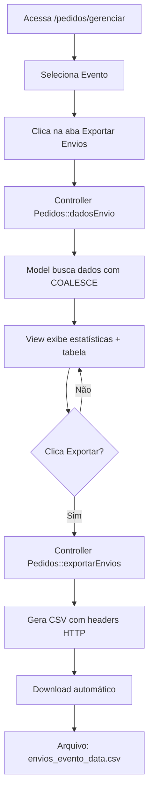

# 📦 Exportação de Dados de Envio

## 📋 Visão Geral

Sistema para visualizar e exportar dados de endereço dos pedidos que precisam ser enviados, com priorização inteligente entre a tabela `enderecos` e `clientes`.

---

## 🎯 Funcionalidades

### 1. **Visualização de Dados**
- Lista todos os pedidos aguardando envio
- Mostra estatísticas em tempo real
- Pré-visualização dos dados antes da exportação
- Filtros e busca integrados (DataTables)

### 2. **Exportação CSV**
- Formato pronto para uso com transportadoras
- Encoding UTF-8 com BOM (Excel-friendly)
- Separador por ponto-e-vírgula (`;`)
- Nome de arquivo automático: `envios_{evento}_{data}_{hora}.csv`

### 3. **Priorização de Endereços**
```sql
COALESCE(e.cep, c.cep) as cep
```
- **Prioridade 1**: Endereço da tabela `enderecos` (específico do pedido)
- **Prioridade 2**: Endereço da tabela `clientes` (cadastro do cliente)

---

## 🗂️ Arquivos Criados/Modificados

### **Novos Arquivos**

1. **`app/Models/DadosEnvioModel.php`**
   - Model dedicado para busca de dados de envio
   - Métodos: `buscarDadosEnvio()`, `contarPedidosParaEnvio()`

2. **`app/Views/Pedidos/dados_envio.php`**
   - Interface visual com estatísticas
   - Tabela de pré-visualização
   - Botão de exportação

### **Arquivos Modificados**

1. **`app/Controllers/Pedidos.php`**
   - Adicionado: `$dadosEnvioModel`
   - Novos métodos:
     - `dadosEnvio($event_id)` - Exibe a view
     - `exportarEnvios($event_id)` - Gera o CSV

2. **`app/Views/Pedidos/gerenciar_evento.php`**
   - Nova aba: "📦 Exportar Envios" (roxa)

---

## 🚀 Como Usar

### **Passo 1: Acessar a Funcionalidade**

1. Acesse: **https://mundodream.com.br/pedidos/gerenciar**
2. Selecione o evento desejado
3. Clique na aba **"📦 Exportar Envios"**

### **Passo 2: Visualizar os Dados**

A tela exibirá:
- **Total de pedidos** aguardando envio
- **Estatísticas** do evento
- **Tabela interativa** com todos os dados

### **Passo 3: Exportar CSV**

1. Clique no botão: **"Exportar CSV para Envio"**
2. O arquivo será baixado automaticamente
3. Abra com Excel ou use diretamente com a transportadora

---

## 📊 Estrutura do CSV

### **Colunas Exportadas**

| Coluna | Origem | Descrição |
|--------|--------|-----------|
| Nome | `clientes.nome` | Nome do destinatário |
| Empresa | Vazio | Não usado |
| CPF | `clientes.cpf` | CPF do destinatário |
| CEP | `COALESCE(enderecos.cep, clientes.cep)` | CEP priorizado |
| Endereco | `COALESCE(enderecos.endereco, clientes.endereco)` | Endereço priorizado |
| Numero | `COALESCE(enderecos.numero, clientes.numero)` | Número priorizado |
| Complemento | Extraído do campo `numero` | Tudo após o primeiro espaço |
| Bairro | `COALESCE(enderecos.bairro, clientes.bairro)` | Bairro priorizado |
| Cidade | `COALESCE(enderecos.cidade, clientes.cidade)` | Cidade priorizada |
| UF | `COALESCE(enderecos.estado, clientes.estado)` | Estado priorizado |
| Aos Cuidados | Vazio | Não usado |
| Nota Fiscal | `N` | Sempre "N" |
| Servico | Vazio | Preenchido pela transportadora |
| Serv. Adicionais | Vazio | Preenchido pela transportadora |
| Valor Declarado | `pedidos.total` | Valor total do pedido |
| Observacoes | Vazio | Observações opcionais |
| Conteudo | `Ingressos Dreamfest 25` | Descrição do conteúdo |
| DDD | Vazio | Não usado |
| Telefone | Vazio | Não usado |
| Email | `clientes.email` | E-mail do cliente |
| Chave | Vazio | Não usado |
| Peso | `0,1` | Peso padrão (100g) |
| Altura | `1` | Altura padrão (1 cm) |
| Largura | `10` | Largura padrão (10 cm) |
| Comprimento | `15` | Comprimento padrão (15 cm) |
| Entrega Vizinho | Vazio | Não usado |
| RFID | Vazio | Não usado |

---

## 🔍 Lógica de Priorização

### **Por que priorizar `enderecos` sobre `clientes`?**

A tabela `enderecos` armazena o endereço específico informado no momento da compra (pode ser diferente do cadastro).

```sql
LEFT JOIN (
    SELECT e1.pedido_id, e1.cep, e1.endereco, e1.numero, e1.bairro, e1.cidade, e1.estado, e1.created_at
    FROM enderecos e1
    INNER JOIN (
        SELECT pedido_id, MAX(created_at) AS max_updated
        FROM enderecos
        GROUP BY pedido_id
    ) sub ON e1.pedido_id = sub.pedido_id AND e1.created_at = sub.max_updated
) e ON e.pedido_id = p.id
```

### **Extração de Complemento**

O campo `numero` pode conter:
- **Formato 1**: `"123"` → Número: `123`, Complemento: `NULL`
- **Formato 2**: `"123 Apto 45"` → Número: `123`, Complemento: `Apto 45`

```sql
SUBSTRING_INDEX(COALESCE(e.numero, c.numero), ' ', 1) as numero

CASE 
    WHEN SUBSTRING_INDEX(COALESCE(e.numero, c.numero), ' ', 1) <> 
         SUBSTRING(COALESCE(e.numero, c.numero), LOCATE(' ', COALESCE(e.numero, c.numero)) + 1) 
    THEN SUBSTRING(COALESCE(e.numero, c.numero), LOCATE(' ', COALESCE(e.numero, c.numero)) + 1) 
    ELSE NULL 
END AS complemento
```

---

## 🎨 Interface Visual

### **Destaques da UI**

1. **Header com Gradiente**: Roxo/violeta para destaque visual
2. **Cards de Estatísticas**: Total de pedidos, evento, status
3. **Botão de Exportação**: Grande, colorido, com animação hover
4. **Tabela Interativa**: DataTables com busca e paginação
5. **Design Responsivo**: Mobile e desktop

### **Cores da Aba**

```css
.tab-menu .tab.purple { 
    background: #a855f7; 
    color: #fff; 
}
.tab-menu .tab.purple.active { 
    background: #9333ea; 
    color: #fff; 
}
```

---

## 🔐 Permissões

### **Requisito**

O usuário precisa ter a permissão:
```php
$this->usuarioLogado()->temPermissaoPara('editar-clientes')
```

Se não tiver, é redirecionado com a mensagem:
```
"[NOME], você não tem permissão para acessar esse menu."
```

---

## 🎯 Filtros Aplicados

### **Pedidos Incluídos**

```sql
WHERE 
    p.frete = 1                                          -- Pedido com frete
    AND (p.rastreio IS NULL OR p.rastreio = '')          -- Sem código de rastreio
    AND p.evento_id = ?                                  -- Do evento selecionado
    AND p.status IN ('CONFIRMED', 'RECEIVED', 'RECEIVED_IN_CASH')  -- Status válidos
```

---

## 📦 Exemplo de Uso

### **Cenário 1: Cliente com Endereço Cadastrado no Pedido**

| Campo | Valor |
|-------|-------|
| Nome | João Silva |
| CEP | 90010-000 (da tabela `enderecos`) |
| Endereço | Rua dos Andradas (da tabela `enderecos`) |
| Cidade | Porto Alegre (da tabela `enderecos`) |

### **Cenário 2: Cliente SEM Endereço no Pedido (Fallback)**

| Campo | Valor |
|-------|-------|
| Nome | Maria Santos |
| CEP | 88015-100 (da tabela `clientes`) |
| Endereço | Av. Beira Mar (da tabela `clientes`) |
| Cidade | Florianópolis (da tabela `clientes`) |

---

## 🛠️ Troubleshooting

### **Problema: "Não há pedidos para envio"**

**Causas possíveis:**
1. Todos os pedidos já têm código de rastreio
2. Nenhum pedido tem `frete = 1`
3. Status dos pedidos não é válido (`CONFIRMED`, `RECEIVED`, `RECEIVED_IN_CASH`)

**Solução:**
```sql
-- Verificar pedidos do evento
SELECT id, cod_pedido, status, frete, rastreio 
FROM pedidos 
WHERE evento_id = 17;
```

### **Problema: CSV com caracteres estranhos (acentos)**

**Causa:** Excel não reconheceu UTF-8

**Solução:** O código já adiciona BOM UTF-8
```php
fprintf($output, chr(0xEF).chr(0xBB).chr(0xBF));
```

Se ainda assim houver problema, abra o CSV em um editor de texto e salve como UTF-8 com BOM.

### **Problema: Endereço incompleto**

**Causa:** Cliente não tem endereço nem em `enderecos` nem em `clientes`

**Solução:**
```sql
-- Identificar clientes sem endereço
SELECT c.nome, c.email, p.id as pedido_id
FROM pedidos p
INNER JOIN clientes c ON c.usuario_id = p.user_id
LEFT JOIN enderecos e ON e.pedido_id = p.id
WHERE p.evento_id = 17
  AND p.frete = 1
  AND e.id IS NULL
  AND (c.cep IS NULL OR c.cep = '');
```

Contatar os clientes para preencher o endereço.

---

## 🔄 Fluxo Completo



---

## 🎓 Aprendizados Técnicos

### **1. LEFT JOIN para Fallback**
Permite buscar primeiro em uma tabela e, se não encontrar, usar outra.

### **2. COALESCE para Priorização**
```sql
COALESCE(tabela_prioritaria.campo, tabela_fallback.campo)
```

### **3. Subquery para MAX(created_at)**
Garante que sempre pegamos o endereço mais recente do pedido.

### **4. BOM UTF-8 para Excel**
```php
fprintf($output, chr(0xEF).chr(0xBB).chr(0xBF));
```

### **5. Headers HTTP para Download Forçado**
```php
header('Content-Type: text/csv; charset=utf-8');
header('Content-Disposition: attachment; filename="..."');
```

---

## ✅ Checklist de Implementação

- [x] Model `DadosEnvioModel` criado
- [x] Métodos no controller `Pedidos` adicionados
- [x] View `dados_envio.php` criada
- [x] Nova aba no menu de `gerenciar_evento.php`
- [x] Priorização COALESCE implementada
- [x] Exportação CSV funcional
- [x] BOM UTF-8 adicionado
- [x] Permissões verificadas
- [x] Interface visual moderna
- [x] Documentação completa

---

## 🚀 Próximos Passos (Opcional)

1. **Importação de Rastreios**: Permitir upload de CSV com códigos de rastreio
2. **Filtros Avançados**: Por cidade, UF, status
3. **Relatórios**: Gráficos de distribuição geográfica
4. **Notificações**: E-mail automático quando o pedido for enviado
5. **Integração API**: Conectar diretamente com API da transportadora

---

**Documentação criada em:** 25/11/2025  
**Versão:** 1.0  
**Autor:** Sistema Mundo Dream

